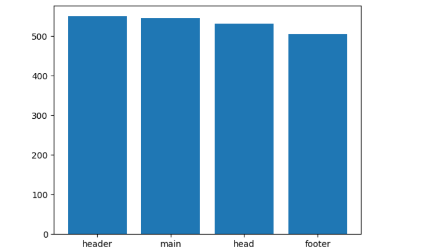
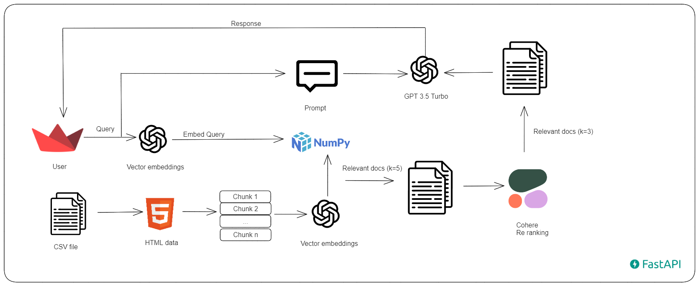
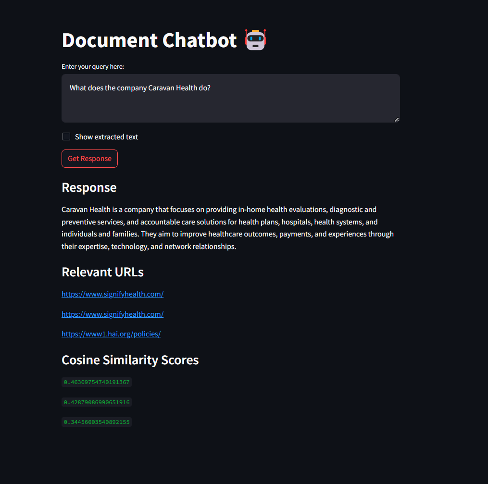

# Gradient Works Exercise

## Part-1

1. How many companies are in the dataset? <br>
There are 75 companies in the dataset.
2. How many unique URLs are in the dataset? <br>
There are 530 unique URLs in the dataset. On analyzing the prefixes of the URLs, it is observed that the URLs are from 77 different domains. 2 of the domains seems to have duplicate URLs.


3. What is the most common chunk type? <br>
The most common chunk type is `header` with 549 occurrences.



4. What is the distribution of chunk types by company? <br>
Please refer to the jupyter notebook under the Notebooks folder for the distribution of chunk types by company.

## Part-2 RAG

### Architecture Diagram



## Steps to run the code
1. Create a `.env` file and place your OPEN_AI API key in this format
```
OPENAI_API_KEY =
COHERE_API_KEY =
```
2. Run the `requirements.txt` file to install all the necessary libraries.
```
pip install -r requirements.txt
```
3. Run `chunking.py` first, as this converts the HTML content to text and saves the processed csv file.
4. Run `embedding.py` next to generate embeddings and store them as a numpy file.
5. The code is also exposed as an API using FASTAPI. To run the API server, run the following command inside the src folder.
```
uvicorn main:app --reload --port 8080
```
This will start the API server at http://localhost:8080. <br>
6. Run `chat.py` next, which opens Streamlit in your browser, allowing you to ask relevant questions based on the csv file provided.
```
streamlit run src/chat.py
```
### Demo


> [!NOTE]  
The code is also available as a jupyter notebook under the notebooks folder.
